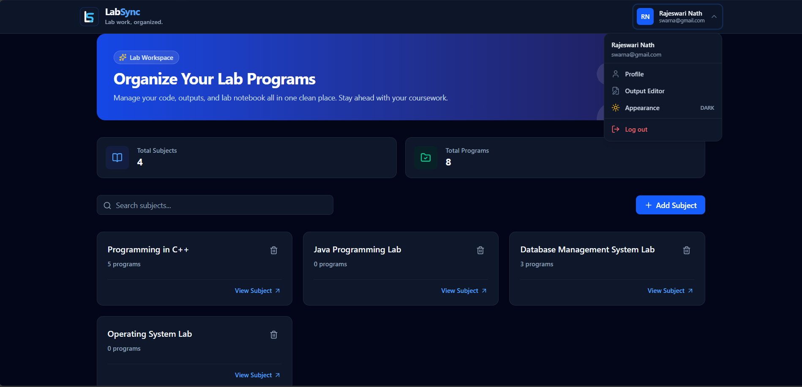
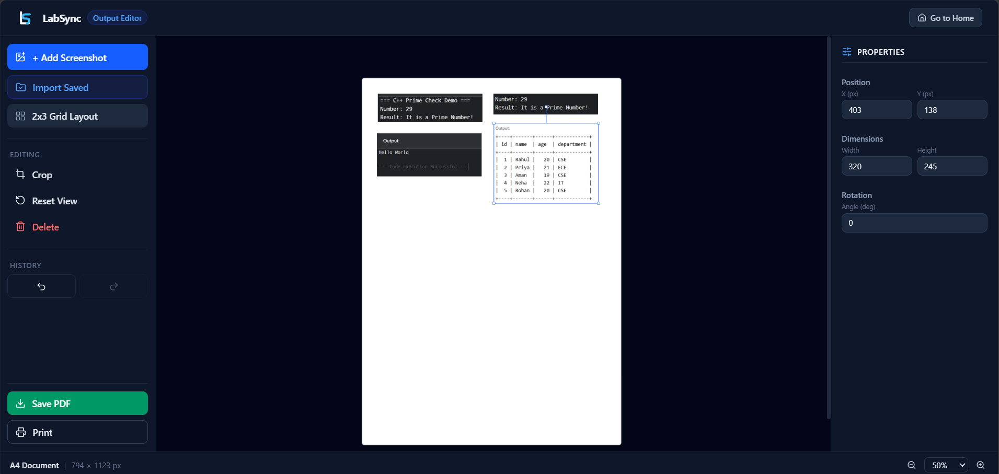

# LabSync

<div align="center">
  
  
</div>

<br>

**LabSync — Your lab work, synced everywhere.**

LabSync is a personal web application designed to make college lab work easier to manage.

Instead of taking screenshots in the lab and later repeating the same work at home just to prepare your lab record, LabSync lets you save your **code, output screenshots, and daily lab work** in one place.

It also includes an **Output Editor** that lets you quickly arrange screenshots into a clean, print-ready format using predefined templates.

## Problem


During college lab classes, you may need to:

1. Write and run code on a lab computer.
2. Get the required output.
3. Take screenshots.
4. Save those screenshots.
5. Later prepare and arrange the screenshots for your lab record.
6. Sometimes repeat the work at home because the screenshots or code are not easily accessible.

The problem isn't just storing screenshots — **preparing them for submission and printing can also be tedious.**

LabSync is built to simplify the entire process.

## Solution

With LabSync:

```text
Lab Computer
     ↓
Write & Run Code
     ↓
Save Code + Output Screenshot
     ↓
LabSync
     ↓
Cloud Storage
     ↓
Access From Mobile / Home
     ↓
Output Editor
     ↓
Choose Template
     ↓
Automatically Arrange Output
     ↓
Print-Ready Result
```

Your lab work stays organized, while your output screenshots can be quickly converted into a clean format for printing.

## Features

* 🔐 User authentication
* 💻 Save source code
* 📸 Upload output screenshots
* 📱 Access lab work from mobile or other devices
* 🗂️ Organize programs by lab date
* 🔗 View previous lab sessions
* 🖼️ Output Editor for arranging screenshots
* ⚡ One-click output templates
* 📐 Resize and reposition output screenshots
* 🖨️ Generate clean, print-ready output layouts
* 🗑️ Delete unwanted submissions
* 🔒 User-specific private data

## Output Editor

LabSync includes an **Output Editor** specifically designed for lab record preparation.

Instead of manually editing screenshots in another application, users can:

1. Select a saved program.
2. Open its output in the editor.
3. Choose a predefined layout/template.
4. Automatically arrange the output screenshot.
5. Adjust the screenshot size and position if needed.
6. Generate a clean layout ready for printing.

The goal is simple:

```text
Screenshot
    ↓
Choose Template
    ↓
One-Click Layout
    ↓
Adjust if Needed
    ↓
Print
```

This removes the need for external image-editing software for basic lab output preparation.


## Tech Stack

### Frontend

* React
* Tailwind CSS
* Axios
* React Router

### Backend

* Node.js
* Express.js
* MongoDB
* JWT Authentication
* ImageKit

## Future Plans

* Chrome extension for quick screenshot capture
* Automatic screenshot upload
* Code editor
* Syntax highlighting
* Export complete lab records
* More output templates
* Multiple device synchronization
* Offline support

## Status

🚧 **Currently in development**

LabSync is being developed as a practical application to solve real problems encountered during college laboratory classes — from **saving lab work to preparing output for submission and printing**.

## Author

**Krishan Das**

GitHub: `Krishan-Das`

---

> **LabSync — Do the lab once. Keep it everywhere.**
